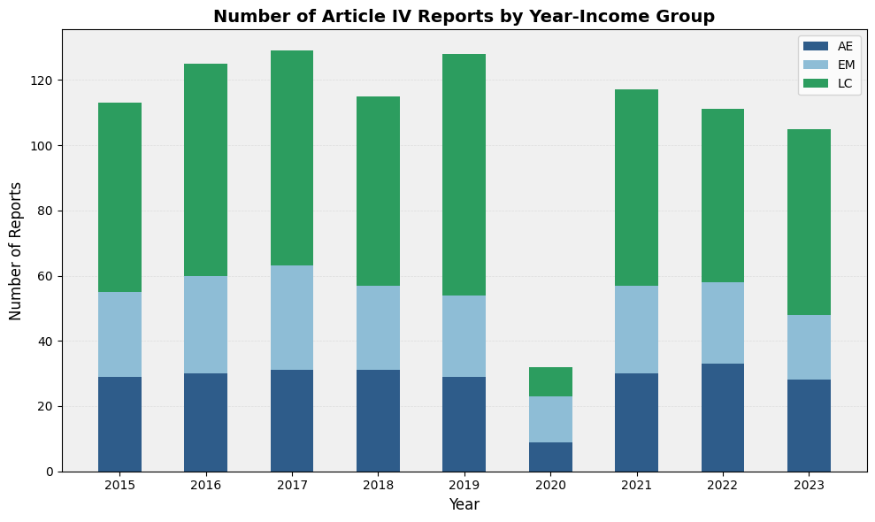
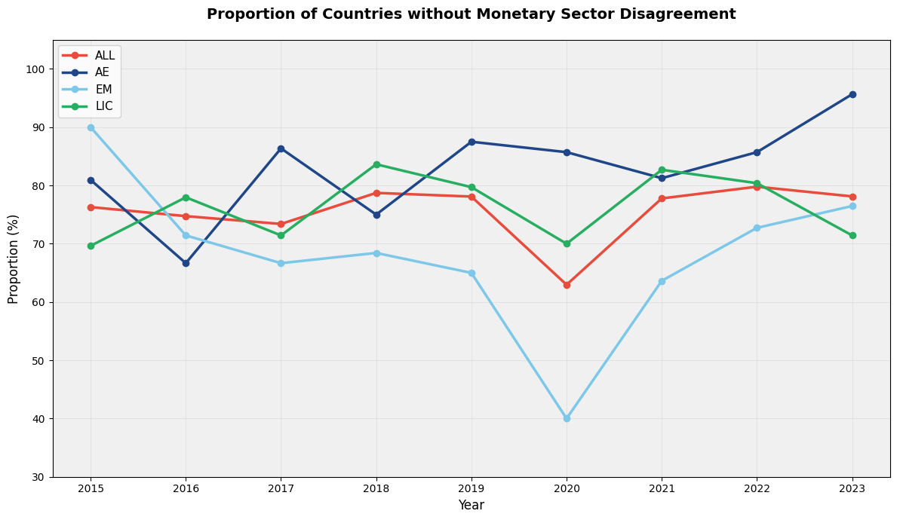
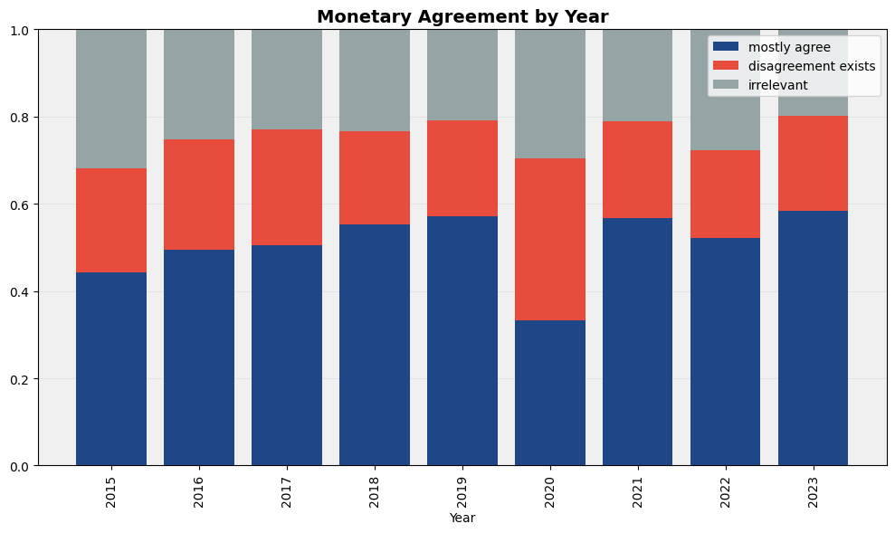
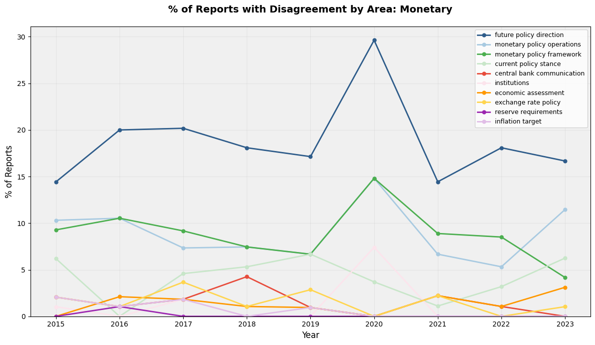
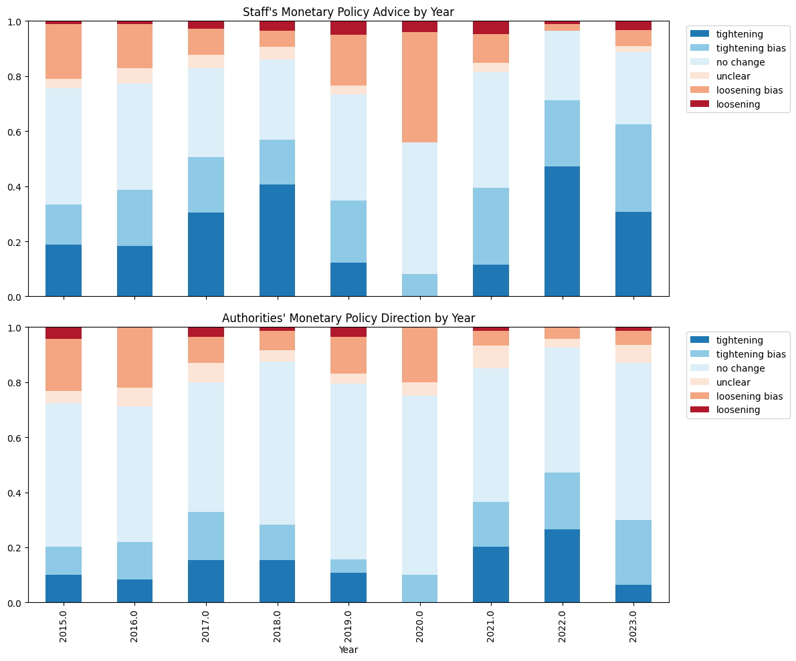
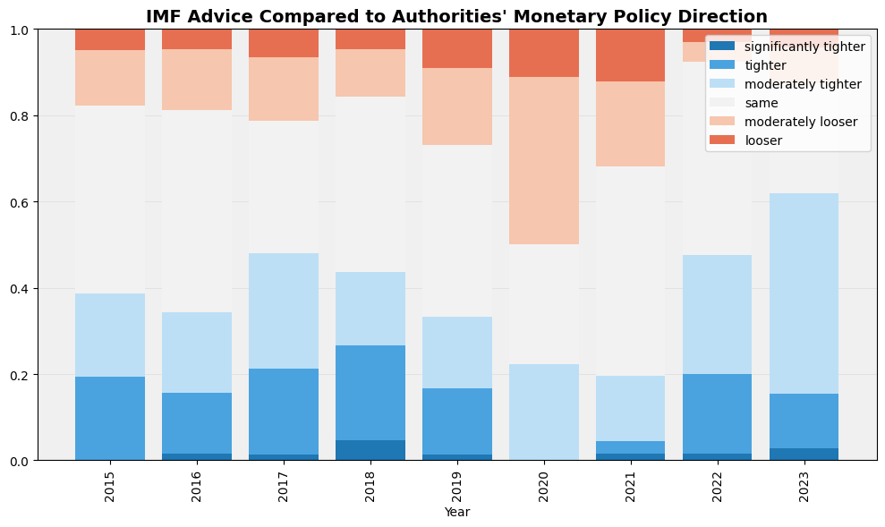
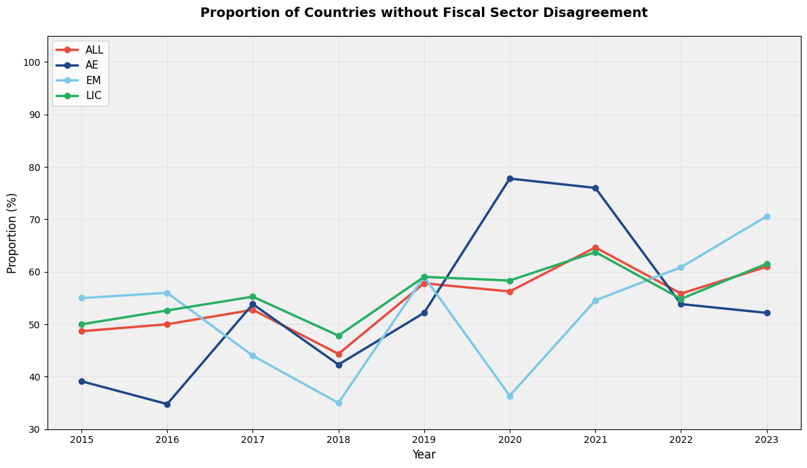
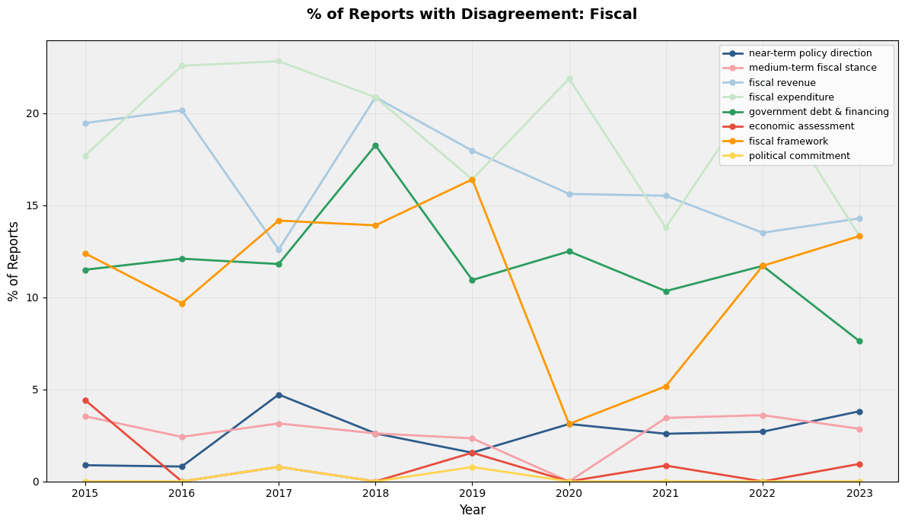
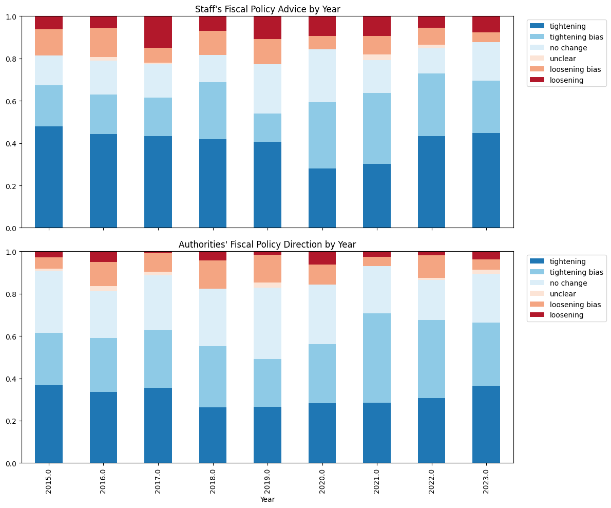
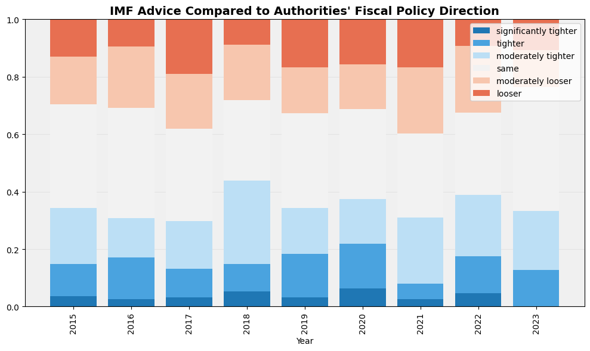

## Overview

### Article IV coverage

**Number of Article IV Reports by Year–Income Group**

## Monetary

### Agreement: no-disagreement share

**Proportion of Countries without Monetary Sector Disagreement**

### Agreement: distribution by year

**Monetary Agreement by Year**

### Disagreement areas: trends

**% of Reports with Disagreement by Area: Monetary**

### Stance (future direction): staff vs authorities (stacked shares)

**Staff’s vs Authorities’ Monetary Policy Direction by Year**

### Stance (future direction): IMF vs authorities comparison buckets

**IMF Advice Compared to Authorities' Monetary Policy Direction**

## Fiscal

### Agreement: no-disagreement share

**Proportion of Countries without Fiscal Sector Disagreement**

### Disagreement areas: trends

**% of Reports with Disagreement: Fiscal**

### Stance (future direction): staff vs authorities (stacked shares)

**Staff’s vs Authorities’ Fiscal Policy Direction by Year**

### Stance (future direction): IMF vs authorities comparison buckets

**IMF Advice Compared to Authorities' Fiscal Policy Direction**

---

Generated from `data_vis.ipynb` embedded outputs.
